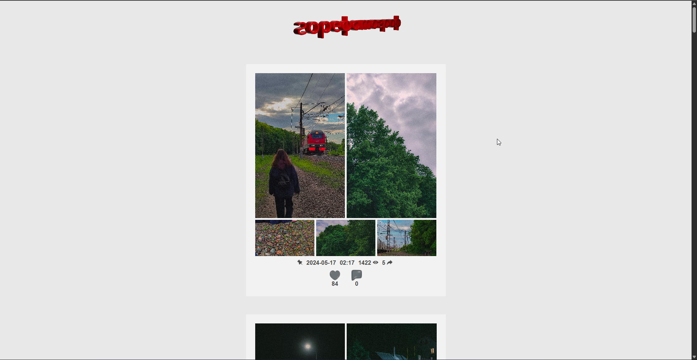
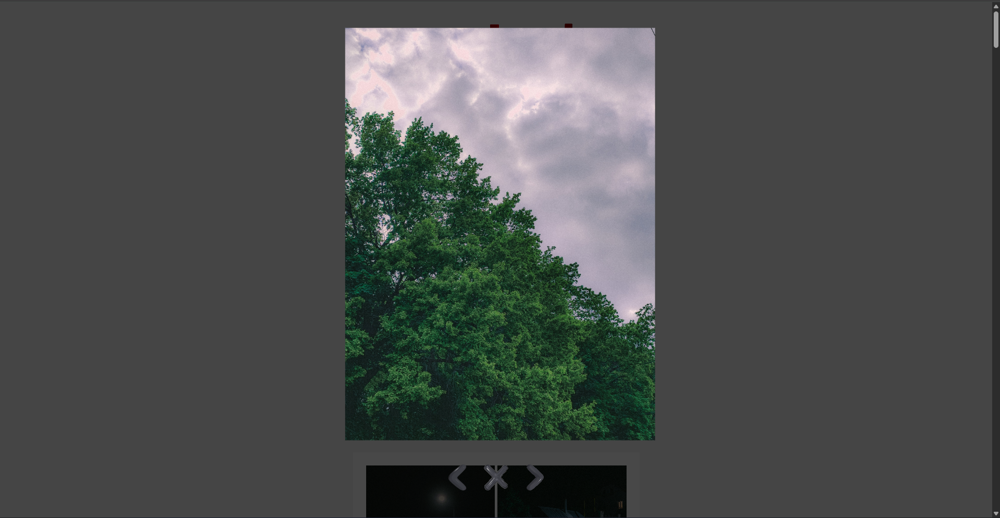

# flask-vkapi

<div>
    
    
</div>

# About the project

Website that provides posts from [VK group](https://vk.com/gorephotographer). The icons were made in blender. Autoloading more posts when reaching the bottom. Nothing special

# Main functions

- Viewing posts

# Used in project

- Python 3.8+
- Flask - web framework
- HTML, CSS, JavaScript

# Downloading and running the website

### 1. Download [Python](https://www.python.org/) and IDE

You can use any IDE you want, for example: PyCharm, VSCode, Python IDLE, etc.

### 2. Download ZIP or use git clone

```bash
git clone https://github.com/middelmatigheid/flask-vkapi.git
cd flask-vkapi
```

### 3. Create virtual environment

If you are using Linux/MacOS

```bash
python -m venv venv
source venv/bin/activate
```

If you are using Windows

```bash
python -m venv venv
venv\Scripts\activate 
```

### 4. Install requirements

```bash
pip install -r requirements.txt
```

### 5. Create VK api service token

Create a service token using [VK](https://vk.com/editapp?act=create)

### 6. Create .env file

Create .env file in the main directory and set up the values

```bash
ACCESS_TOKEN='YOUR TOKEN HERE'
```

### 7. Run the website

```bash
python main.py
```

Website would be available at http://127.0.0.1:5000 or http://localhost:5000

# Project structure

```bash
flask-vkapi/
├── main.py               # Main file to run the website
├── templates/            # HTML templates
├── static/               
│   ├── css/              # CSS styles
│   ├── js/               # JavaScript files
│   └── images/           # Icons
├── requirements.txt      # Python requirements
└── .env                  # Environment variables
```
